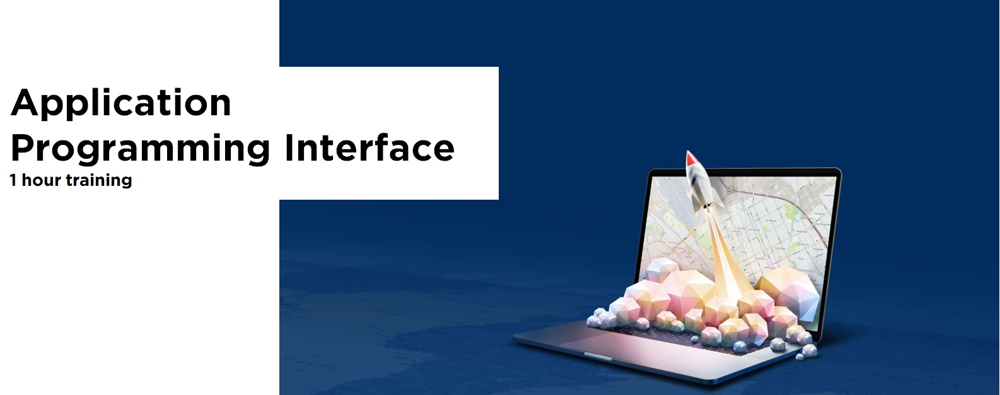

# Why Application Programming Interface (API)?
API are highly used to make the work easier and speed up the development process of other systems and applications. Because of that, many private and public companies make available their data via API services. The main goal is to allow applications to access data and interact with external software components.
To simplify this explanation let's just take TomTom Maps API as an example. TomTom provides maps and traffic data, with global coverage & advanced functionalities to companies integrate map and traffic data into their systems. Instead of creating a map service from scratch, companies that use API services from other companies can be more concentrated on solving their business problem instead of solving every single problem that needs to be solved to make their product viable.

Knowing that private and public companies have been making their data available via APIs it is crucial for people that work with data to understand how API services work and how to query data and extract data from it.

### Topics covered in this tutorial:
1. Set up environment.
2. What is an API?
3. JSON and GEOJSON structures
4. How to access Data from APIs?
5. More examples of companies that make data available via APIs
6. Challenges - TomTom Maps API.
7. Mention.

### Link to virtual enviroment to test and run the code
* [1 Hour API Training](https://mybinder.org/v2/gh/abraaonascimento/1_Hour_API_Training/HEAD) - After the set up, click in 1_hour_api_training.ipynb to open the notebook.
