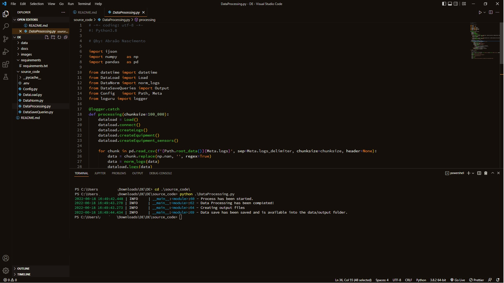

# Challenge

### How does the process work?
The data flow consisting of 5 steps. 

- Step 1: Gets the .log, .csv and .json files available in the  from the `/data` folder.
- Step 2: Reading data on-demand (chunk size of 100.000) 
- Step 3: Normalizes the data in order to make them well structured, easy to read and to query.
- Step 4: Loads data by batch into a PostgreSQL database 
- Step 5: Query the data and save the results in csv files.

### Documents
* At `/docs` there is a technical documentation available in 3 formats .pdf, .html, .ipynb. If you want to read and have a better experience reading it open the .html file (this code/doc is a **SIMPLIFIED** version just to present some data analysis in a good visual and the results).

**The production code is available in:** `/source_code/`

### Production Code / Run via command line
* The production code (script) can executed via command line in `/source_code/`.
- Command: *Python DataProcessing.py* or  *Python3 DataProcessing.py (in Linux)*

**The output will be saved in .csv files.**

- How to Run. Example:

### Deployment / Set up
* The requirements needed to run this project are available at `/source_code/` 

**Tools**
* Python >= 3.8 
* PostgreSQL 
    - database must contain the extension hstore
    - database name, credentials can be set on the .env file
   
### Possible extra features
This report can be extended to a Django end-point API which makes it easy to be integrated into other systems or a report can be automatically created using open source tools like https://streamlit.io/ or paid as Power BI. 

### Final Comments
This process could have used parallelism (with dask python library for example) to make the data load faster, but using parallelism requieres more RAM memory. The main idea was to have a good and fast process without running out of memory.

### Author
* Abraão Nascimento, Data Engineer, linkedin: https://www.linkedin.com/in/abra%C3%A3o-nascimento-39915162/
