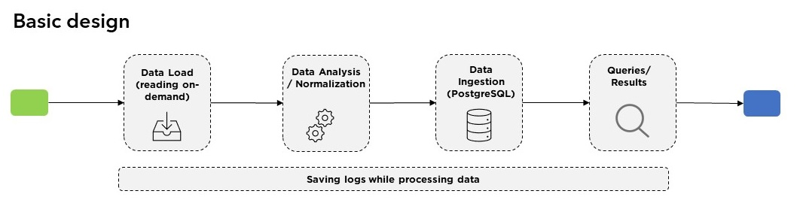

# Data Engineer Pratical Test

#### How does the process work?
The data flow consisting of 4 steps. 

- Step 1: Gets the .log, .csv and .json files available in the  from the `/data` folder.
- Step 2: Normalizes the data in order to make them easy to read and to query.
- Step 3: Creates a temporary SQL database and loads the data into it.
- Step 4: Query the data and expose the results.

### Documentation
* At `/docs` there is a technical documentation available in 3 formats .pdf, .html, .ipynb. If you want to read and have a better experience reading it open the .html file (this code/doc is simplified to have a good understanding of the logic).

#### Deployment / Set up
* The requirements needed to run this project are available at `/requirements/requirements.txt` 

#### Script / Run via command line
* The script where can executed via command line in `/source_code/DataEngineer_PraticalTest.py`.
- Command: *Python source_load.py*

**The output will be saved in .csv files.**

#### Possible extra features
This report can be extended to a Django end-point API which makes it easy TO be integrated into other systems or a report can be automatically created using open source tools like https://streamlit.io/ or paid as Power BI. 

#### Author
* Abraão Nascimento, Data Engineer, linkedin: https://www.linkedin.com/in/abra%C3%A3o-nascimento-39915162/